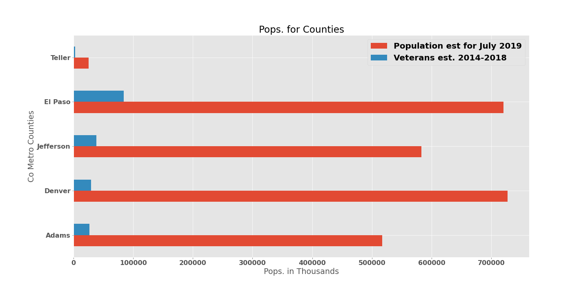
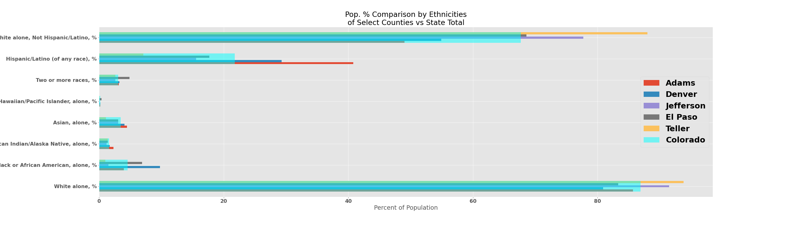

# Devon Silk Capstone 1 Project

In this capstone 1 project I am trying to answer the following question(s):

   "How does Colorado's Veteran population compare to the National Census ethnicity breakdown numbers? And how does the state of Colorado itself compare on ethnicity breakdown numbers? 

# Data Used

When looking at data dealing with both veterans (vets) and populations (pops), I turned to the best sources: The VA and the US Census Bureau (referred to as US Census form her on). From the VA I was able to get Veteran population numbers for Colorado. These numbers were broken down into the same ethnicity categories that the US Census uses. They were, however, just the raw numbers of each, not percentages. I also got data on the pops of vets in each of the Congressional districts. 

The information from the Census had to be taken in parts due to their filtering system on their website. From them I got information on the total population of the US, Colorado, and 5 counties in CO that help make up the two major metropolitan areas, Denver and Colorado Springs (those counties being Adams, Denver, and Jefferson for Denver, and El Paso and Teller for Colorado Springs)

        

            This dataframe is after some cleaning and combining of different csv files. 
   
# Breaking down the Data

1. Looking at the above chart, one can begin to see how areas are broken down by the differnt ethnicities. I wanted to see first how the city of Colorado Springs compared against the numbers for both Colorado and the US:
 

   *Looking at the avove chart, one can see that the percentages of all the ethnicities don't add up to 100%, but go much higher. There is quite a bit of overlap between two of the groups that I didn't want to change out of fear of altering the data too much.*
   
   
2. Next, I wanted to compare the numbers of 5 select counties that make up the majority of Colorado's two major metro areas: Adams, Denver, and Jefferson for Denver Metro, and El Paso and Teller for Colorado Springs (together they're the Pikes Peak Region):

3. I also looked at the populations of those counties for their total pop and Veteran pop:

4. The above chart doensn't make it clear on population percentage of each county. For instance it appears that Teller has almost no veterans at all. This left me with a question the Census Bureau didn't ask: What's the percentage of Vets to population per county?

4. 
  *While the Census Bureau didn't have that information, this is what that above percentage looks like from the VA for the whole state:*

*source VA.gov*
                          
                          
5. Looking at VA statistics, we are able to find the total number of vets in CO, by their ethnicities:

    *Just like the Census data, the VA's data for veteran ethnicities doesn't add up to 100%, but again surpasses it.*
    
    
6. I wanted to see what the breakdown of counties vs Colorado Springs, Colorado, and the US numbers were:

## The Take Away
As I tried to answer my questions, I ran into some conflicting data that made getting the best answers more tricky than originally thought. As mentioned above, there was overlapping data for a couple of the ethnic groups. This muddied the water that was the data: I could see something, but wasn't sure exactly. While I wasn't able to get the "percentage point" answer I was hoping for, I was able to get pretty close to it. Looking at the two graphs below, we can see the following: they share the same curve. 

In looking at the first graph from up top (seen again below), we're able to see the answer to the second question: For the most part, Colorado and the USA are fairly similar, but do have their differences. Besides being whiter, Colorado has a a higher percentage of Hispanic/Latino, yet lower in Black or African American. 

## Data for Further Study

With the 2020 election looming near, I wanted to find the number of vets per Congressional district and was hoping to find out if that had any impact on how those districts voted.

We can see that there are more vets in CD5 than both CD1 and CD2 combined.

Here's a map of Colorado and its Congressional districts:

*Source Wikipedia*

And here's the results from 2018 on how those districts went:

*source Wikipedia*

Given the information that I had, I was hoping that I could have found the "magic number" that would have meant the world to polsters: if a county has a vet percentage between a certain range, it would vote one way or the other. I'm sure that the number is in there somewhere, I'm just not experienced enough yet to find it. 